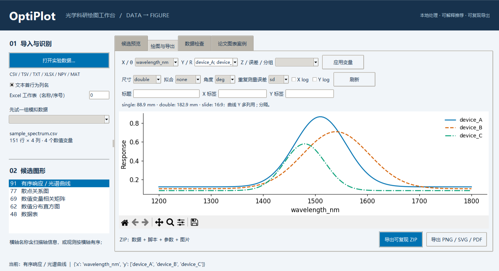
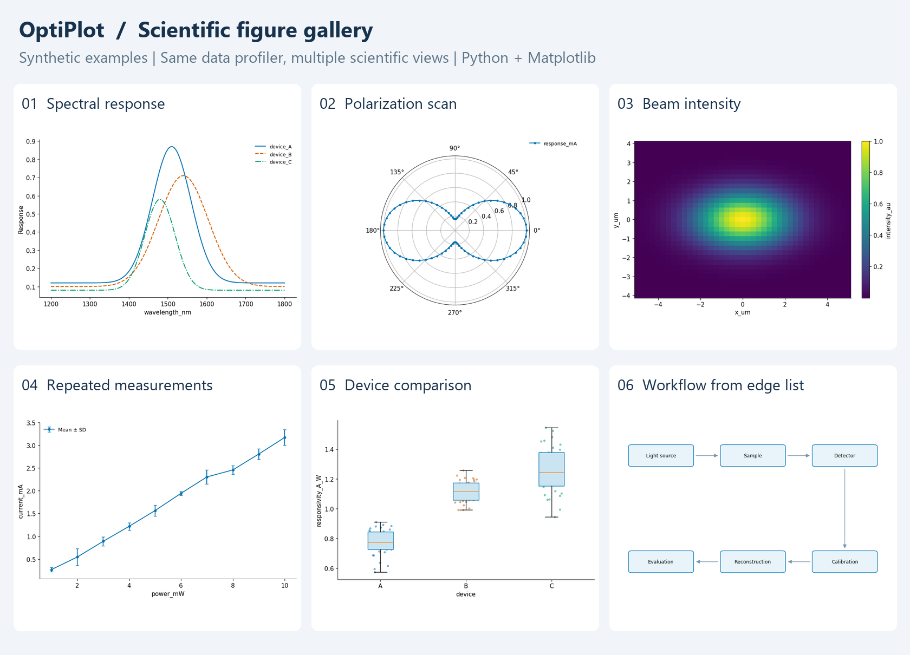

# OptiPlot · 光学科研绘图工作台

**[English](#english) · [中文](#中文)**

---

# English

Turn experimental data into a small set of comparable, adjustable, reproducible scientific figures. Python + Matplotlib, everything processed locally — no model API required.



## What it does

You import measurement data. OptiPlot profiles its structure, then proposes **ranked figure candidates with a written reason for each**, so you compare ways of drawing the same data instead of guessing which plot is defensible.

- **Import** — CSV, TSV, whitespace-separated TXT, a chosen XLSX worksheet, NPY, and 1-D/2-D real-valued MAT (v4–v7.2). Headerless files and UTF-8/GB18030 text are supported.
- **Profile** — numeric vs categorical variables, constants, identifier columns, missing and infinite values, angle units, scan axes, explicit error columns, within-group replicates, complete 2-D grids.
- **21 figure types** — multi-spectrum lines, stacked curve family, two-column difference, two-column ratio, min–max envelope, wavelength axis with a photon-energy conjugate, derivative spectrum, dual-axis response pair, peak and FWHM versus a scan parameter, scatter with optional OLS, hexbin density, error bars, heatmap, filled contour, matrix heatmap, polar response, histogram, box with raw points, correlation matrix, data table, flow diagram.
- **Style control** — 99 presentation parameters covering fonts and sizes, canvas in millimetres, spines, ticks, grid, markers, line styles, legend, colour palette, colour map and export options. Four cross-group presets (`journal`, `slide`, `poster`, `default`), and any configuration saves to a JSON file the whole group can share.
- **Export** — 300 dpi PNG, editable SVG, PDF, TIFF; plus a reproducible ZIP containing the full imported table, drawing parameters, the resolved style, version record, SHA-256 checksum, a standalone Python script and all three image formats.
- **Figure-type library** — 134 drawing recipes grouped by figure type, each stating the columns it needs and how to draw it. Deliberately free of citations: the plots are the product, so no DOI or evidence label appears under them. Separately, 25 bibliographic records document that this set of figure types came from reading real top-journal figures; see [literature provenance](docs/literature.md).
- **Batch** — the command line uses the same recommender and renderer as the GUI.

## Quick start

**Windows: double-click `启动OptiPlot.bat`.** The launcher checks the project virtual environment, then system Python and existing Conda environments, and only selects one whose dependencies are complete. It never installs anything or touches your environment.

On a fresh machine:

```powershell
python -m venv .venv
.\.venv\Scripts\python.exe -m pip install -r requirements.txt
.\.venv\Scripts\python.exe app.py
```

macOS / Linux: install dependencies then run `python app.py`; Linux needs the system `python3-tk` package. Python ≥ 3.10. If several Pythons are installed, set `OPTIPLOT_PYTHON` to choose the interpreter.

Workflow: import data (or pick a bundled simulation) → read the data inspection for missing values, inferred units and variable roles → compare the candidate previews and their reasons → choose one and map X/Y/Z, labels, size, angle unit, SD/SEM → export.

```python
from optiplot import analyze_file, recommend
from optiplot.render import render

profile = analyze_file("examples/sample_spectrum.csv")
for choice in recommend(profile):
    print(choice.title, choice.tier_label, choice.reason)
render(profile, recommend(profile)[0], "figure.svg", options={"size": "double"})
```

To replay an exported ZIP: unzip, `pip install -r requirements.txt`, run `python render_plot.py`. It needs neither the OptiPlot source nor the original machine's paths.

## Which columns your experiment needs

| Experiment | Recommended columns | Preferred figures |
|---|---|---|
| Spectral sweep | `wavelength_nm, sample_A, sample_B` | multi-curve lines, scatter |
| Polarization sweep | `angle_deg, response_mA` | polar if non-negative; line if signed |
| 2-D scan | `x_um, y_um, intensity_au` | heatmap, contour |
| Repeated measurements | `power_mW, current_mA`, several rows per power | mean ± sample SD, optional SEM |
| Uncertainty already known | `wavelength_nm, response, response_sem` | keeps the stated SEM definition |
| Device comparison | `device, responsivity_A_W` | grouped box with raw points |
| Workflow | `source, target`, one edge per row | flow diagram |
| 2-D numeric matrix | NPY or MAT array | matrix heatmap on row/column index |

A column named `sample_A` is not given units automatically — write the real axis labels before exporting. Encoding a category as numbers will be read as a quantity, so convert it to text first. A 2-D grid must be unique and complete; repeated coordinates are not averaged silently.

## Limits of this version

Tiers (high / medium / low) state how completely your data meets each figure type's preconditions. They are **not statistical confidence**, and they do not certify a scientific conclusion. The software never decides your physical model, normalisation or significance test.

- Lines keep acquisition order and gaps. Nothing is smoothed or fitted automatically.
- Error bars use only explicit error columns or genuine repeated observations, computed per group. Single-point groups get no invented uncertainty.
- A signed polarization response is not drawn as an ordinary polar radius; signed maps default to a zero-centred diverging colourscale.
- Linear fitting is a user-selected full-range OLS showing R². There is no physical model library, confidence band or interval fitting.
- Flow diagrams need an edge list and cap at 18 nodes. Experimental procedure is not inferred from measurement data, and this is not 3-D device or optical-path drawing.
- Table images preview the first 14 rows × 8 columns; full data stays in the exported CSV. Correlation matrices show at most 12 columns.
- Figures are edited and exported one at a time. Multi-panel composition from the case recipes still requires extending the export script.

Figure colours use the colourblind-safe Okabe-Ito palette and do not depend on interface settings, so exported images stay reproducible. Size presets are a general starting point — check the target journal before submitting.

This is the **0.2.0 runnable preview**. The knowledge base is not 108 downloaded original figures and not a complete survey of Q1/Q2 journals; journal quartiles are explicitly marked unverified pending a list with year and evaluation scheme, and conferences are not given quartiles. The software is MIT-licensed; original paper images are not included in the source package.

See the [roadmap](docs/roadmap.md) for what this project deliberately does not do and how to add a figure type, the [figure inventory](docs/figure-inventory.md) for what else your data could be drawn as, plus [architecture](docs/architecture.md), [contributing](CONTRIBUTING.md), [validation](docs/validation.md) and [literature provenance](docs/literature.md).

---

# 中文

把实验数据变成几种可比较、可调整、可复现的科研图。Python + Matplotlib，全部在本地处理，无需大模型 API。


## 立即使用

**Windows：双击 `启动OptiPlot.bat`。** 启动器先检查项目虚拟环境，再检查系统 Python 和已有 Conda 环境；只选择依赖完整的环境，不修改环境、不联网安装。

首次安装到其他电脑：

```powershell
python -m venv .venv
.\.venv\Scripts\python.exe -m pip install -r requirements.txt
.\.venv\Scripts\python.exe app.py
```

macOS / Linux：安装依赖后运行 `python app.py`；Linux 需要系统的 `python3-tk`。Python ≥ 3.10。若已安装多个 Python，可用 `OPTIPLOT_PYTHON` 指定启动器使用的解释器。

操作顺序：

1. 在左侧选择模拟数据，或导入自己的实验数据。
2. 先看数据检查中的缺失项、单位推断与变量类型。
3. 比较前四种候选预览，其他候选在左侧列表；点击“选择并编辑”。
4. 调整 X/Y/Z、标签、尺寸、角度单位、SD/SEM；需要时显式启用线性拟合或对数轴。
5. 导出 PNG/SVG/PDF，或导出带数据与 Python 脚本的可复现 ZIP。



画廊内所有数据均由固定种子生成，**不是任何论文的实验结果**。

## 已实现

- **数据导入**：CSV、TSV、空白分隔 TXT、XLSX 指定工作表、NPY、一维/二维实数 MAT（v4–v7.2）。支持无表头和 UTF-8/GB18030 文本。
- **数据分析**：数值/分类变量、常量、编号、缺失值、无限值、角度单位、扫描轴、显式误差列、组内重复测量、完整二维网格。
- **21 类画法**：多光谱曲线、堆叠曲线族、两列差值、两列比值、多列极差包络、波长轴加光子能量副轴、导数谱、双 Y 轴响应、峰位与半高宽随扫描参量演化、散点与可选线性拟合、六边形分箱密度、误差棒、热图、等高线、矩阵热图、极坐标、直方图、箱线与原始点、相关矩阵、数据表、流程关系图。
- **GUI**：多候选预览、推荐理由、数据检查、列映射、交互缩放平移、单栏/双栏/汇报尺寸。
- **图型子类库**：134 条画法配方，按图型归类，各自写明需要的数据列与绘制方法。**刻意不含引用信息**——图本身就是产品，每张图下面不挂 DOI 或证据级别。另有 25 篇题录在[文献调研与来源](docs/literature.md)中说明这套图型来自对真实顶刊图表的阅读。
- **样式控制**：99 个呈现参数，覆盖字体与字号、毫米级画布尺寸、脊线、刻度、网格、标记、线型、图例、调色板、色带与导出选项。四个跨组预设（`journal` / `slide` / `poster` / `default`），任何配置都能存成 JSON 文件供全组共享。
- **导出**：300 dpi PNG、可编辑 SVG、PDF、TIFF；ZIP 包含完整导入表、绘图参数、解析后的完整样式、版本记录、SHA-256、独立运行的 Python 脚本和三种图片。
- **批处理**：命令行使用同一推荐和渲染引擎；`research/collect_openalex.py` 为开发期题录候选采集器，支持分页、缓存和去重，不属于产品运行时。

本版是 **0.2.0 可运行初版**。案例库不是 108 张下载原图，也不是完整的一区二区普查。期刊分区均明确标为未核验，等待有年份与评价体系的清单；会议不套用期刊分区。软件采用 MIT 许可，原论文图片未包含在源码包中。

## 数据如何组织

|实验|推荐数据列|优先画法|
|---|---|---|
|光谱扫描|`wavelength_nm, sample_A, sample_B`|多曲线、散点|
|偏振扫描|`angle_deg, response_mA`|非负响应极坐标；有符号响应折线|
|二维扫描|`x_um, y_um, intensity_au`|热图、等高线|
|重复测量|`power_mW, current_mA`，每个功率多行|均值 ± 样本 SD；可选 SEM|
|已有不确定度|`wavelength_nm, response, response_sem`|保留显式 SEM 定义|
|器件比较|`device, responsivity_A_W`|分组箱线与原始点|
|工作流程|`source, target`，每行一条边|流程图|
|二维数值矩阵|NPY 或 MAT 二维数组|按行列索引显示的矩阵热图|

`sample_A` 等列名不会自动赋予单位，请在导出前填写真实坐标标签。角度名称带 `deg` 或 `rad` 可减少歧义。编号列不会当作器件性能；分类值编码为数字时，建议先转为文本类别。二维网格要求坐标唯一、覆盖完整，重复坐标不自动平均。

## 命令行与 Python API

```powershell
python -m optiplot.cli examples/sample_spectrum.csv --out optiplot_output --top 4 --bundle
```

```python
from optiplot import analyze_file, recommend
from optiplot.render import render

profile = analyze_file("examples/sample_spectrum.csv")
choices = recommend(profile)
for choice in choices:
    print(choice.title, choice.tier_label, choice.reason)
render(profile, choices[0], "figure.svg", options={"size": "double"})
```

独立复现：解压 GUI 导出的 ZIP，安装其中的 `requirements.txt`，运行 `python render_plot.py`。无需 OptiPlot 源码或原电脑路径。CSV 是导入后整理过的完整数据表；无穷值会转为缺失值并记录，MAT 只包含本次明确选择的数组。

## 科研表达的边界

推荐等级（高 / 中 / 低）表示数据满足该图型前提条件的程度，不是统计置信度，也不证明图中的科学结论。程序不替用户决定物理模型、归一化方式或显著性检验。

- 折线保留采集顺序与缺失间断；不自动平滑或拟合。
- 误差棒只使用显式误差列或真实重复观测，分组分别统计；单点组不虚构误差。
- 有负值的偏振响应不直接画成普通极坐标半径；正负热图默认使用以零为中心的发散色图。
- 线性拟合采用用户选择的全范围 OLS，显示 R²；当前不提供物理模型库、置信带或区间拟合。
- 流程图需要边列表，最多 18 节点；不会从测量数据猜出实验流程，也不等同于三维器件/精确光路绘制。
- 表格图片只预览前 14 行、8 列；完整数据保存在导出 CSV。相关矩阵最多显示 12 列。
- 本版逐图编辑和导出；案例配方中的多面板拼版、比例尺、矢量场叠加等仍需在导出脚本中扩展。

图形数据配色使用色盲安全的 Okabe-Ito 调色板，不随界面设置变化，以保证导出结果可复现。尺寸预设是通用工作起点，投稿时按目标期刊核对。字体、单位、可访问配色和矢量导出的设计参考 [Nature 官方图表指南](https://research-figure-guide.nature.com/figures/preparing-figures-our-specifications/)，不宣称自动满足所有期刊规范。

## 文献收集与扩展

详见 [文献调研与来源](docs/literature.md)。例如：

```powershell
python research/collect_openalex.py --query "metasurface photodetector" --query "computational imaging" --max-pages 5 --max-records 400
```

这是候选题录检索，不是自动全文图像理解；本版没有把未经运行的采集上限计入已收集数量。可读全文和原图仍需核对图号、实际样式、授权和分区后入库。

详见 [路线图](docs/roadmap.md)（本项目明确不做什么、以及新增图型的正确顺序）、[可绘图型清单](docs/figure-inventory.md)（给定数据还能画成什么）、[架构](docs/architecture.md)、[贡献说明](CONTRIBUTING.md) 和 [验证记录](docs/validation.md)。
