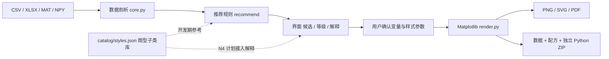

# 架构与扩展

推荐引擎只以实际数据结构为输入。`recommend()` 不读取任何 JSON 案例库——历史上它有一个 `catalog_path` 参数但从未被引用，已删除。**能画什么由 `render.py` 的分支决定，不由案例记录数决定。**

当前没有机器学习训练或多模态论文理解服务。原始文件不上传；联网只发生在用户明确运行题录采集器时。

## 模块职责

| 文件 | 职责 |
|---|---|
| `optiplot/core.py` | 导入、验证、物理变量名称启发式、推荐条件与等级。`analyze_dataframe` 不修改调用者的 DataFrame。列名判断分三层：`_same_quantity` 只看单位/词干是否同一物理量，`_comparable` 在其上再加"两者都不能是坐标轴"（给逐点差值与比值用），`_twin_measurements` 只排除真正的坐标（波长/时间/x/y），因为两台功率计读同一批器件是最常见的比对场景。`MAX_CANDIDATES` 是一份数据最多提几个候选（按 `examples/` 量出来的，不是审美值），配套测试盯住任何被截掉的样例 |
| `optiplot/style.py` | 样式参数的唯一所有者。`Style` 是不可变 dataclass，负责把参数路由到 Matplotlib 的六个应用点：`rc_params()`（绘制期继承）、`figure_kwargs()`（Figure 构造）、`bake_into()`（逐 artist，字体族）、`configure_axes()`（逐 Axes：定位器、格式化器、范围、网格）、`apply_margins()`（逐 Axes 子图位置，仅 `layout="none"`）、`legend_kwargs()` 与 `series_style()` / `errorbar_kwargs()`（逐 artist 参数，因为 `legend.ncols` 等没有 rcParam）、`savefig_kwargs()`（导出）。共 113 个字段。`from_options()` 把一次传入的扁平 dict 拆成「样式」与「数据内容」两半，未知键直接报错。`AXIS_STYLED` 限定哪些图型可以套用轴样式（折线类全部在册，图像/示意/极坐标类除外；孪生轴继承刻度与范围但不再叠一层网格） |
| `optiplot/render.py` | 确定性 Matplotlib 渲染器。`FIGURE_TYPES` 是图型 ID 的权威列表；样式参数走 `Style`；每种图显式消耗 `Recommendation.encodings`。`FIT_CHOICES` 是拟合入口的唯一来源（GUI 下拉、CLI `--fit`、`options["fit"]` 三处共用），`FITTABLE` 声明哪些图型接受拟合，名单外的图型收到 `fit` 就报错，而不是画一张看不出问题的图（`FIT_REFUSAL` 给需要解释原因的图型补一句）。图型按**画法**而非名字分组：`PAINTED_GRID_KINDS` 只包含用 `pcolormesh` 涂格子的二维图，`surface_3d` 一类三维图型不在其中——名字里都有 surface，把它们混在一个元组里会让三维图被派到 `QuadMesh` 上直接崩掉。同一批有序扫描的画法集中在 `LINE_KINDS`（普通曲线、双对数、半对数、累积）：共用「保留采集顺序与缺测间断」的画线主体，只在落笔前算的是什么上分岔，`FORCED_LOG` 声明某个图型自己锁定的坐标尺度。所有 histogram 画法（单列分布、散点边缘、成对图对角）共用 `_bin_count`，所以一个 `hist_bins` 在三处含义一致；`GRID_OWNED` 的图型把标题写到 Figure 而不是某一格；图型专属参数由 `TYPE_OPTIONS` 登记、`OPTION_OWNERS` 反查，`render()` 在门口把不属于该图型的参数抛成 `OptionNotApplicable`（它是 `ValueError` 的子类，所以只处理"画不出来"的调用方照旧工作，批量接口又能单独跳过这一类） |
| `optiplot/models.py` | 具名物理模型库与最小二乘入口。引擎不自动拟合，模型必须由用户点名。每个模型带 `caveat`（参数在什么条件下不再可辨识）与 `x_scaled`（带横轴量纲的参数，超出扫描范围时报警）；`fit_model` 的失败一律抛中文 `ValueError`，不返回一个看起来成功的结果 |
| `optiplot/export.py` | 完整表格、配方与数据校验、独立渲染脚本、版本及图片打包 |
| `optiplot/cli.py` | 批量导出接口。`--set KEY=VALUE` 透传图型专属参数（值先按 JSON 解析，所以 `relative=true` 是真布尔）；一份参数服务一批不同图型，因此不消耗该参数的候选被点名跳过而不是让整批失败 |
| `app.py` | Tkinter 展示层，共用引擎，不重复实现统计逻辑（将由 Web 前端替换） |
| `catalog/styles.json` | 图型子类库：`id` / `label` / `patterns` / `data_schema` / `recipe`。只引用 `FIGURE_TYPES` 中的 ID，由测试强制 |
| `catalog/papers.json` | 题录。项目级凭据，用于说明图型集合来自真实顶刊阅读；**不接入渲染路径，不在每张图下方展示** |
| `research/` | 开发期工具与调研笔记，不属于产品运行时 |

## 字体：一条绕不过去的 Matplotlib 约束

`font.sans-serif` 是一个列表，但 **Matplotlib 不逐字形回退**，而中文字体（雅黑、宋体、楷体）自带拉丁字形。后果是二选一：

| 字体栈顺序 | 中文 | `family`（拉丁字体族） |
|---|---|---|
| 中文在前 | 正常 | **失效**——拉丁文字也被中文字体接管 |
| 拉丁在前 | **豆腐块 □□□□** | 正常 |

所以 `Style` 把两者做成显式互斥，而不是让两个都半坏：图里有中文就必须中文字体在前，`family` 只作缺字形后备；纯英文图（投稿常态）设 `cjk="none"`，`family` 才完全生效。

**第二条约束**：`font.family` 每次绘制时从 rcParams 重新读取，而 `render()` 返回后调用方才绘制——那时 rc 上下文已关闭，字体会静默回落到全局默认。字号没有这个问题（创建 artist 时已固化），字体族有。

因此 `Style.bake_into(fig)` 是必需的：附加真实渲染器、强制绘制一次以生成刻度标签、再把解析好的字体栈逐个写到 Text artist 上。之后这张图无论在哪里绘制——GUI 画布、savefig、还是重放可复现包——都自带自己的排版。

`tests/test_style.py` 里两个测试各守一类静默失败：`test_chinese_text_actually_renders_with_the_default_style` 把字形缺失的 UserWarning 提升为错误，`test_family_knob_changes_latin_glyphs_when_cjk_is_off` 用 PNG 哈希证明 `family` 真的改变了像素。改排版相关代码时不要绕过它们。

**测试不得断言本机字体存在。** CI 跑 Ubuntu，字体集与开发用的 Windows 完全不同：断言 `font_stack()[0] == "Times New Roman"` 在 Windows 绿、在 CI 红，而且失败原因与代码无关。约定是：需要具体字体名时用 `first_installed(FAMILY_PRESETS[...])` 比较解析结果，需要中文字形时用 `require_cjk()` 在无字体环境跳过。验证办法是临时把 `installed_families` 收窄到只有 DejaVu 再跑一遍，应当是 skip 而不是 fail。

## 数据层的来历

`catalog/styles.json` 由 `catalog/cases.json`（108 条带出处的案例）迁移而来，迁移脚本保留在 `research/migrate_cases_to_styles.py`。迁移丢弃了 `paper_id` / `figure` / `source_url` / `evidence` / `implementation_scope` / `checked_date` / `visual_review` 七个逐条出处字段，保留 `label` / `patterns` / `data_schema` / `recipe`。

原因是这些字段在产品中没有任何消费者：它们既不参与推荐，也不该出现在输出图上。出处信息改由 `papers.json` 在项目层面承担。

## 新增一个图型的正确顺序

1. 定义图型 ID 与**完整的列编码契约**（需要哪些列、什么角色、缺了会怎样）
2. 在 `core.py` 的 `recommend()` 加适用条件与推荐等级
3. 在 `render.py` 的 `_draw()` 加分支，并把该 ID 加入 `FIGURE_TYPES`
4. 用**真实失效边界**验证：空列、全缺失、单点、含负值、含 inf、超宽矩阵、重复坐标
5. 在 `catalog/styles.json` 补至少 3 个子类

`test_styles_reference_real_figure_types` 会拒绝引用未实现图型的子类，所以第 3 步和第 5 步的顺序不能颠倒太久。

**不要**把参考论文里的复杂功能直接写成已实现的产品功能。

## 已知限制

数据推断与渲染当前在 GUI 主线程，适用于中小规模研究数据。六边形分箱可改善高密度散点显示，但数十万行或超宽矩阵仍可能令界面等待。下一阶段可增加后台加载、可取消任务、通道选择与按需预览。

样式参数管道已建立（`optiplot/style.py`），A 排版、B 画布的 `size`、C 坐标轴、D 数据系列、E 图例、F 颜色、H 导出、I 样式预设八组已落地。仅剩 B 画布余下部分（自定义尺寸与单位、宽高比锁定、四边留白、布局方式、背景色）。

**I 样式预设**：`Style.from_preset(name, **overrides)` 取四个跨组预设之一；`save_preset` / `load_preset` 读写纯 JSON，供课题组共享统一出图风格。可复现 ZIP 的 recipe 记录**完整解析后的样式字典**并附带 `style.json` 与 `style.py`，所以重放不依赖"当前版本恰好使用什么默认值"。预设的判断标准是它必须横跨多组（每个内置预设改动 10–11 个字段）；只动一组的不是预设。

**新增候选值时的硬性要求**：任何"可选值列表"（`SHADINGS`、`MARKERS`、`MARKER_FILLS`、`PALETTES`、`LEGEND_LOCS`、`SIZES`）都必须有测试把每个候选走一遍**完整绘制**。matplotlib 对不认识的 `shading` 只警告然后静默替换，对不合法的 `fillstyle` 要等到真正绘制才抛错——只断言"能赋值"或"属性读得到"都拦不住。

扩展优先级见 [roadmap](roadmap.md)：图型扩充与样式参数系统在前；多面板排版、带量纲的列角色配置、光路 SVG 元件、物理拟合模型插件随后。Python 引擎是本版实现，MATLAB 渲染后端尚未实现。
