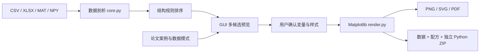

# 架构与扩展

推荐引擎以实际数据结构为输入，案例库用于解释和探索迁移画法。当前没有机器学习训练或多模态论文理解服务。原始文件不上传；联网只发生在用户明确运行题录采集器或打开来源链接时。

- `optiplot/core.py`：导入、验证、物理变量名称启发式、推荐条件与分数。`analyze_dataframe` 不修改调用者的 DataFrame。
- `optiplot/render.py`：13 类确定性 Matplotlib 渲染器。可选拟合、角度单位、尺寸、对数轴等放在 `options`。每种图显式消耗 `Recommendation.encodings`。
- `optiplot/export.py`：完整表格、配方与数据校验、独立渲染脚本、版本及图片打包。
- `optiplot/cli.py`：批量导出接口。
- `app.py`：Tkinter 展示层，共用引擎，不重复实现统计逻辑。
- `catalog/papers.json` / `cases.json`：来源与迁移方法，独立于规则代码。历史 `flowchart` 案例 ID 在 GUI 映射为 `flow`。图型 ID 的权威列表是 `render._draw` 的分支，不再另维护一份 JSON 清单。
- `research/collect_openalex.py`：开发期题录候选采集，不属于产品运行时；人工库禁止覆盖。

新增图型：定义图型 ID 与完整的列编码契约，在核心引擎添加适用条件，在渲染器添加分支，并用真实失效边界验证。新增案例只需 JSON；不要将参考论文的复杂功能写成已实现的产品功能。

数据推断与渲染当前在 GUI 主线程，适用于中小规模研究数据。六边形分箱可改善高密度散点显示，但数十万行或超宽矩阵仍可能令界面等待。下一阶段可增加后台加载、可取消任务、通道选择与按需预览。

扩展优先级：带可靠分区元数据的图像级案例审查；多面板排版；带量纲的列角色配置；更完整的光路 SVG 元件；物理拟合模型插件。Python 引擎是本版实现，MATLAB 渲染后端尚未实现。
