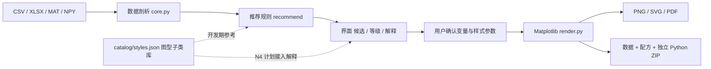

# 架构与扩展

推荐引擎只以实际数据结构为输入。`recommend()` 不读取任何 JSON 案例库——历史上它有一个 `catalog_path` 参数但从未被引用，已删除。**能画什么由 `render.py` 的分支决定，不由案例记录数决定。**

当前没有机器学习训练或多模态论文理解服务。原始文件不上传；联网只发生在用户明确运行题录采集器时。

## 模块职责

| 文件 | 职责 |
|---|---|
| `optiplot/core.py` | 导入、验证、物理变量名称启发式、推荐条件与等级。`analyze_dataframe` 不修改调用者的 DataFrame |
| `optiplot/render.py` | 确定性 Matplotlib 渲染器。`FIGURE_TYPES` 是图型 ID 的权威列表；样式参数走 `options`；每种图显式消耗 `Recommendation.encodings` |
| `optiplot/export.py` | 完整表格、配方与数据校验、独立渲染脚本、版本及图片打包 |
| `optiplot/cli.py` | 批量导出接口 |
| `app.py` | Tkinter 展示层，共用引擎，不重复实现统计逻辑（将由 Web 前端替换） |
| `catalog/styles.json` | 图型子类库：`id` / `label` / `patterns` / `data_schema` / `recipe`。只引用 `FIGURE_TYPES` 中的 ID，由测试强制 |
| `catalog/papers.json` | 题录。项目级凭据，用于说明图型集合来自真实顶刊阅读；**不接入渲染路径，不在每张图下方展示** |
| `research/` | 开发期工具与调研笔记，不属于产品运行时 |

## 数据层的来历

`catalog/styles.json` 由 `catalog/cases.json`（108 条带出处的案例）迁移而来，迁移脚本保留在 `research/migrate_cases_to_styles.py`。迁移丢弃了 `paper_id` / `figure` / `source_url` / `evidence` / `implementation_scope` / `checked_date` / `visual_review` 七个逐条出处字段，保留 `label` / `patterns` / `data_schema` / `recipe`。

原因是这些字段在产品中没有任何消费者：它们既不参与推荐，也不该出现在输出图上。出处信息改由 `papers.json` 在项目层面承担。

## 新增一个图型的正确顺序

1. 定义图型 ID 与**完整的列编码契约**（需要哪些列、什么角色、缺了会怎样）
2. 在 `core.py` 的 `recommend()` 加适用条件与推荐等级
3. 在 `render.py` 的 `_draw()` 加分支，并把该 ID 加入 `FIGURE_TYPES`
4. 用**真实失效边界**验证：空列、全缺失、单点、含负值、含 inf、超宽矩阵、重复坐标
5. 在 `catalog/styles.json` 补至少 3 个子类

`test_styles_reference_real_figure_types` 会拒绝引用未实现图型的子类，所以第 3 步和第 5 步的顺序不能颠倒太久。

**不要**把参考论文里的复杂功能直接写成已实现的产品功能。

## 已知限制

数据推断与渲染当前在 GUI 主线程，适用于中小规模研究数据。六边形分箱可改善高密度散点显示，但数十万行或超宽矩阵仍可能令界面等待。下一阶段可增加后台加载、可取消任务、通道选择与按需预览。

样式参数目前只有 `size / fit / angle_unit / error_type / title / xlabel / ylabel / xlog / ylog / dpi`；字体、线宽、线型、标记、图例与刻度尚不可调，这是 N3 的范围。

扩展优先级见 [roadmap](roadmap.md)：图型扩充与样式参数系统在前；多面板排版、带量纲的列角色配置、光路 SVG 元件、物理拟合模型插件随后。Python 引擎是本版实现，MATLAB 渲染后端尚未实现。
